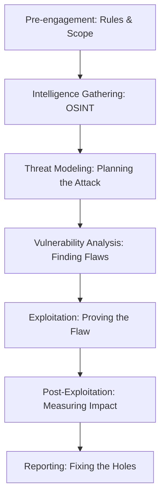
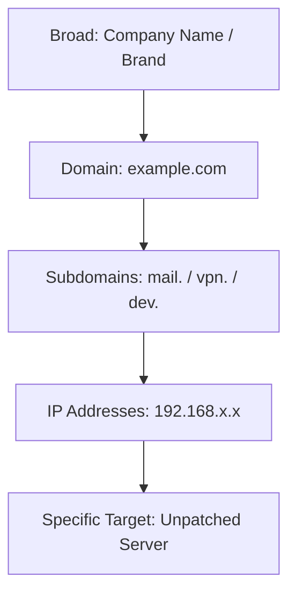
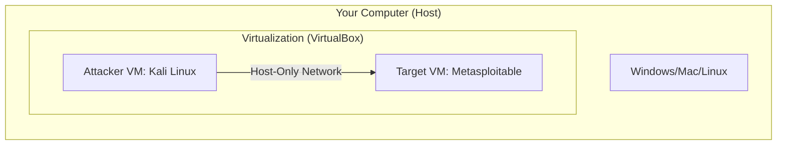

# Offensive Security: The Master Lesson

> "To know your enemy, you must become your enemy." — Sun Tzu

Welcome to the world of **Offensive Security**. This isn't just about "hacking"; it's about the proactive discipline of finding weaknesses before the bad guys do. This lesson will take you from a curious beginner to understanding the professional methodologies, tools, and mindsets used by ethical hackers worldwide.

---

## 1. The Ethical Hacker's Mindset

Offensive security is the **"Guard Dog"** of the digital world. While defensive security (Blue Teaming) builds walls and monitors cameras, offensive security (Red Teaming) tries to find the hole in the fence or the unlocked window.

### Key Philosophy:
*   **Proactivity**: Don't wait for a breach. Find it first.
*   **Empathy**: Think like an attacker to understand their goals and methods.
*   **Ethics**: Always operate with explicit permission and within a defined scope.

---

## 2. Professional Methodologies
In the professional world, we don't just "poke around." We follow strict roadmaps to ensure we are thorough and professional.

### The PTES (Penetration Testing Execution Standard)
This is the "Gold Standard" for testing. It ensures a consistent and high-quality assessment.

---

## 3. The Hacker's Toolkit
Every master needs their tools. Here are the "Big Four" that every beginner should know.

| Tool | Category | "In Plain English..." |
| :--- | :--- | :--- |
| **Nmap** | Discovery | Like a digital radar that finds every "door" (port) and "window" (service) on a server. |
| **Metasploit** | Exploitation | A massive library of "digital keys" (exploits) for known vulnerabilities. |
| **Burp Suite** | Web Testing | A "middleman" that lets you intercept and change messages between your browser and a website. |
| **Wireshark** | Network Analysis | A digital magnifying glass that lets you see every tiny bit of data traveling through the air or cables. |

---

## 4. The 5-Step Workflow (In Action)

Let's imagine we are testing a small company's server.

1.  **Reconnaissance (The Spy Phase)**

Reconnaissance is the most critical phase. About **70-80% of a successful attack** is actually just research. It is divided into two main flavors:

#### A. Passive Reconnaissance (OSINT)
In this phase, you **never touch the target**. You are like a detective looking through public records, trash, and social media.
*   **Google Dorking**: Using advanced search operators (e.g., `site:example.com filetype:pdf "confidential"`) to find sensitive files indexed by Google.
*   **WHOIS Lookups**: Checking domain registration to find the owner's name, email, and IP ranges.
*   **TheHarvester**: A tool that automatically scrapes search engines and LinkedIn for employee emails and subdomains.
*   **Shodan**: Known as the "Search Engine for the Internet of Things." It lets you find exposed webcams, servers, and routers without even pinging them.

#### B. Active Reconnaissance
Now, you make **direct contact**. This is riskier because the target might notice you "knocking" on their digital doors.
*   **DNS Interrogation**: Asking the target's name servers for a list of all their subdomains (like `dev.admin.example.com`).
*   **Port Scanning (Light)**: Sending a small probe to see if a specific door is open.

### The "Recon Funnel"
Hacker's start broad and narrow down their focus through research:

---

2.  **Scanning (The Knocking Phase)**: We use **Nmap** to see which ports are open. *Is the front door open? Is the back window unlocked?*
3.  **Gaining Access (The Entry Phase)**: We find a vulnerable version of a service (like an old FTP server) and use **Metasploit** to get inside.
4.  **Maintaining Access (The Persistence Phase)**: We want to make sure we can get back in if the server reboots. This is proving how a real attacker could hide long-term.
5.  **Covering Tracks (The Ghost Phase)**: We erase our logs (only in a simulation!) to show how an attacker might hide their presence.

---

## 5. Setting Up Your "Hacking Lab"

**CRITICAL: Never practice on systems you don't own.** To learn safely, you need a "Lab."

### The Lab Architecture

### Quick Setup Guide:
1.  **Hypervisor**: Install [VirtualBox](https://www.virtualbox.org/). It lets you run "computers inside your computer."
2.  **The Attacker**: Download [Kali Linux VirtualBox Image](https://www.kali.org/get-kali/#kali-virtual-machines). It comes pre-loaded with all the tools.
3.  **The Target**: Download [Metasploitable 2](https://sourceforge.net/projects/metasploitable/). It is a "Swiss Cheese" server—full of holes for you to find.
4.  **Isolation**: Set both VMs to use a **"Host-Only Adapter"** in VirtualBox settings. This keeps your practice safely tucked away from your home internet.

---

## 6. Practice Exercise: Your First Scan
Once your lab is ready:
1.  Open Kali Linux.
2.  Open a terminal.
3.  Find the IP of your target (Metasploitable): `fping -asg 192.168.56.0/24`
4.  Run a basic scan: `nmap -sV <Target_IP>`
5.  **Challenge**: Look at the list of services. Can you find one that looks "old" or "vulnerable"?

---

## 7. Legal & Ethical Warning
Before you run a single command:
> **Unauthorized access to any computer system is a crime.**
Ethical hacking requires **Permission, Scope, and Responsibility**. If you don't have a written agreement, don't do it. Use your lab to grow your skills safely!

---

## Conclusion
Offensive security is a journey of constant learning. By mastering the tools and following professional methodologies, you aren't just "hacking"—you're becoming a vital part of the global defense against cyber threats.

**Next Steps:**
*   Explore [TryHackMe](https://tryhackme.com/) for guided paths.
*   Join the [OWASP community](https://owasp.org/) to learn about web security.